# 🎭 Claude Code Personas


> **"Seamlessly manage multiple identities in Claude Code."**

**Claude Code Personas** is a powerful plugin that lets you switch between different Claude accounts, credentials, and settings instantly. Perfect for developers who juggle work, personal, and project-specific environments.

---

## ✨ Features

- **Isolated Environments**: Each persona has its own `~/.claude` directory.
- **Atomic Switching**: Switch profiles instantly and safely without breaking your setup.
- **Keychain Integration**: Automatically backup and restore OAuth credentials on macOS.
- **Zero Configuration**: Works out of the box with intelligent defaults.
- **Team Friendly**: Easy to distribute via marketplace settings.

---

## 📦 Installation

### 1️⃣ Add Marketplace

```bash
/plugin marketplace add Jeonhui/claude-code-personas
```

### 2️⃣ Install Plugin

```bash
/plugin install personas@claude-code-personas
```

---

## 🛠️ Usage

### Quick Start

Create and switch to a work profile in seconds:

```bash
/personas:create work
/personas:switch work
```
*(Restart Claude Code after switching for changes to take full effect)*

### 🎮 Commands

| Command | Description |
| :--- | :--- |
| `/personas:list` | 📋 List all available personas & status |
| `/personas:create <name>` | ➕ Create a new isolated persona |
| `/personas:switch <name>` | 🔄 Switch active persona & credentials |
| `/personas:login [name]` | � Login/Create & Clear auth for new flow |
| `/personas:status` | ℹ️ Show current persona info |
| `/personas:logout` | 🚪 Logout & clear credentials |
| `/personas:delete <name>` | 🗑️ Delete an inactive persona |

### 👥 Multi-Account Workflow

**Step 1: Setup Work Account**
```bash
/personas:login work
# Follow the OAuth flow to log in
```

**Step 2: Setup Personal Account**
```bash
/personas:login personal
# Follow the OAuth flow to log in
```

**Step 3: Switch Contexts**
```bash
/personas:switch work       # 🏢 Ready for business
/personas:switch personal   # 🏠 Ready for side projects
```

---

## 💻 Standalone CLI

Prefer the terminal? Use the CLI directly:

```bash
# Install globally or link
cd plugins/personas && npm link

# Use anywhere
claude-profile create work
claude-profile switch personal
```

---

## 🚀 How It Works

This plugin manages your `~/.claude` directory by symlinking it to specific profiles under `~/.claude-profiles/`.


When you switch personas:
1.  **Backup**: Current credentials are saved to the profile.
2.  **Swap**: The symlink is atomically updated.
3.  **Restore**: Target credentials are loaded into the Keychain.

### Sequence Diagram: Switch Command

```mermaid
sequenceDiagram
    participant User
    participant CLI
    participant Manager
    participant Keychain
    participant FileSystem

    User->>CLI: switch work
    CLI->>Manager: switch(work)
    
    Manager->>Keychain: read creds
    Keychain-->>Manager: json string (current)
    
    Manager->>FileSystem: save to default/
    
    Manager->>FileSystem: swap symlink
    
    FileSystem-->>Manager: read work/.credentials
    
    Manager->>Keychain: write creds
    
    Manager-->>CLI: done
    CLI-->>User: ✓ Switched
```



---

## 📂 Project Structure

```
~/.claude-profiles/
├── default/          # 🏠 Original config
├── work/             # 🏢 Work profile
└── personal/         # 👤 Personal profile
```

### Source Overview

| File | Role |
| :--- | :--- |
| `src/manager.ts` | ⚙️ Core logic for profile management |
| `src/utils/fs.ts` | � Secure filesystem operations |
| `src/utils/keychain.ts` | 🔐 macOS Keychain integration |

---

## 🤝 Contributing

Contributions are welcome! Please feel free to submit a Pull Request.

## 📄 License

[MIT](LICENSE) © [Jeonhui](https://github.com/Jeonhui)
