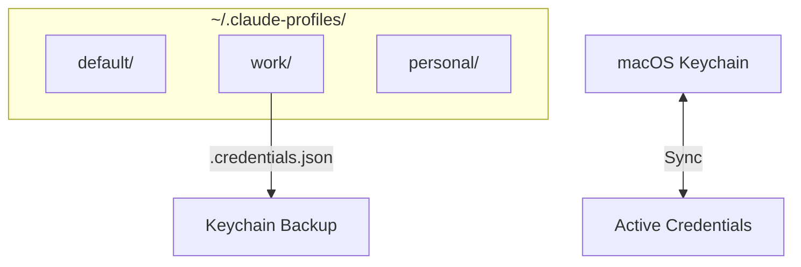
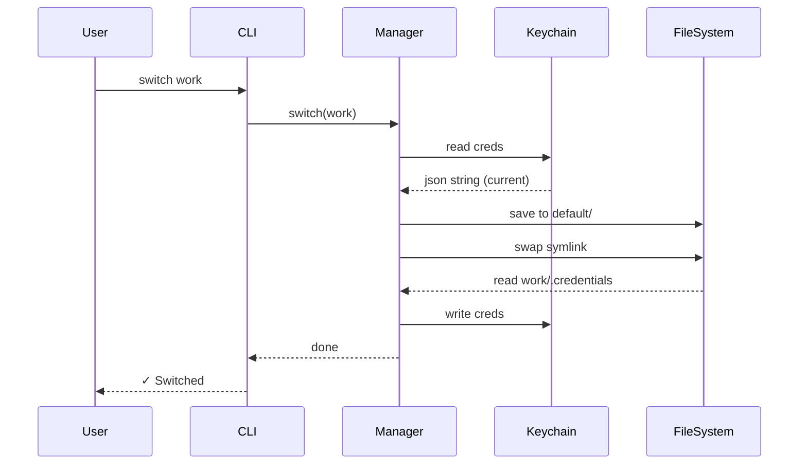

# 🔐 Credential Switching — Operational Logic


> **"How Claude Code Personas manages authentication across multiple accounts."**

This document explains the technical architecture for switching Claude Code login identities simultaneously when switching profiles.

---

## 🧐 Background

Claude Code stores its state in two primary locations:

| Storage | Content | Path / Service |
| :--- | :--- | :--- |
| **Filesystem** 📂 | Config, sessions, project data | `~/.claude/` |
| **macOS Keychain** 🔑 | OAuth credentials (tokens) | Service: `Claude Code-credentials` |

**The Problem:** Previous methods only swapped the `~/.claude` directory. Since authentication data persists in the Keychain, switching profiles didn't actually change the logged-in user.

---

## 🏗️ Solution Architecture

To solve this, each profile directory acts as a vault, containing both configuration and a backup of the Keychain credentials.



### Directory Structure

```text
~/.claude-profiles/
├── default/
│   ├── .profile-metadata.json
│   └── .credentials.json          ← 🔐 Keychain Backup
├── work/
│   └── .credentials.json
└── personal/
    └── .credentials.json
```

---

## 🔄 Core Workflows

### 1. Switch Profile

**Target:** `default` (active) ➔ `work`

1.  **📥 Read**: Fetch current credentials from Keychain (`security find-generic-password`).
2.  **💾 Backup**: Save credentials to `default/.credentials.json`.
3.  **🔗 Swap**: Update `~/.claude` symlink to point to `work/`.
4.  **📤 Restore**:
    *   If `work/.credentials.json` exists ➔ Load into Keychain.
    *   If missing ➔ Clear Keychain (require login).

> **Result:** `work` profile active + `work` account authenticated.

### 2. Login (New Account)

**Command:** `claude-profile login work`

1.  **✅ Verify**: Check if "work" profile exists (create if needed).
2.  **🔄 Switch**: Perform standard switch (Backup current ➔ Swap).
3.  **🧹 Clear**: Delete current Keychain credentials (`security delete-generic-password`).
4.  **👋 Handover**: User runs `claude` to start OAuth flow.

> **Result:** `work` profile active but **unauthenticated**. New credentials will be saved to Keychain after user logs in.

### 3. Logout

**Command:** `claude-profile logout`

1.  **🗑️ Delete**: Remove credentials from Keychain.
2.  **🔥 Purge**: Delete `.credentials.json` from profile directory.

---

## 🛠️ Keychain Interaction

We use the macOS `security` CLI for strict isolation.

| Action | Command |
| :--- | :--- |
| **Read** 📥 | `security find-generic-password -s "Claude Code-credentials" -w` |
| **Write** 📤 | `security add-generic-password -s "..." -w <json> -U` |
| **Delete** 🗑️ | `security delete-generic-password -s "..."` |

-   **Service**: `Claude Code-credentials` (Fixed)
-   **Account**: OS Username
-   **Value**: JSON string (OAuth tokens, subscription info)

---

## 📊 Status Display

The CLI clearly indicates the authentication state of each persona:

```text
Claude Code Profiles:

▸ work (active) — pro ✓ — last used just now
  personal — authenticated ✓ — last used 2h ago
  test — not authenticated — last used 5d ago
```

| State | Source | Meaning |
| :--- | :--- | :--- |
| **Active** | 🔑 Keychain | Real-time system authentication state. |
| **Inactive** | 📄 `.credentials.json` | Snapshot from last usage. |

---

## 🛡️ File Security

| File/Folder | Permission | Access |
| :--- | :--- | :--- |
| `.credentials.json` | `0o600` | Owner Read/Write Only |
| Profile Directory | `0o700` | Owner Access Only |

---

## 💻 Platform Support

| Feature | macOS  | Linux / Windows 🐧 |
| :--- | :---: | :---: |
| **Profile Switching** | ✅ | ✅ |
| **Credential Sync** | ✅ | ❌ (Ignored) |
| **Login / Logout** | ✅ | ❌ (Error) |

> **Note:** Process detects `darwin` platform. On non-macOS, Keychain logic is bypassed while directory switching remains functional.

---

## 📈 Sequence Diagram

Summary of the `switch` command flow:

