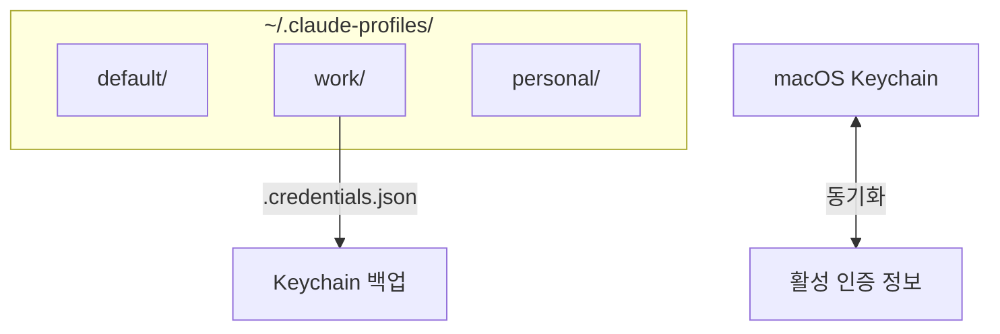
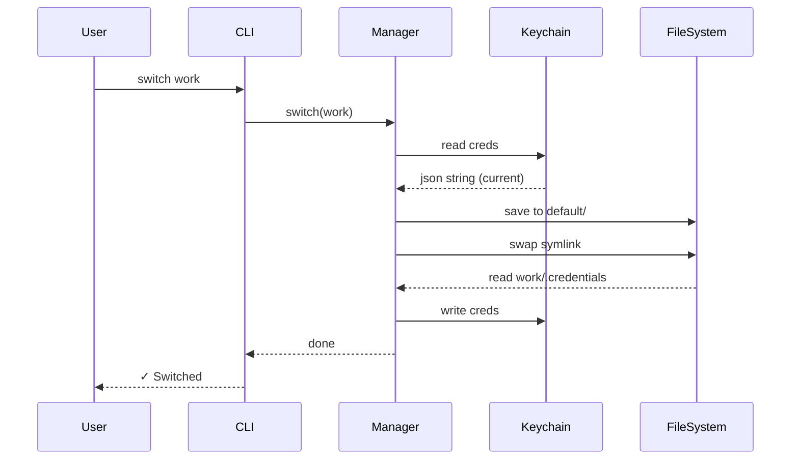

# 🔐 인증 정보 전환 (Credential Switching) — 동작 원리


> **"Claude Code Personas가 다중 계정의 인증을 관리하는 방법."**

이 문서는 프로필 전환 시 Claude Code의 로그인 계정도 함께 전환되는 기술적 구조를 설명합니다.

---

## 🧐 배경 (Background)

Claude Code는 상태 정보를 두 가지 주요 위치에 저장합니다:

| 저장소 | 내용 | 위치 / 서비스 |
| :--- | :--- | :--- |
| **파일시스템** 📂 | 설정, 세션, 프로젝트 데이터 | `~/.claude/` |
| **macOS Keychain** 🔑 | OAuth 인증 정보 (토큰 등) | 서비스: `Claude Code-credentials` |

**문제점:** 기존 방식은 `~/.claude` 디렉토리(심볼릭 링크)만 교체했습니다. 하지만 인증 정보는 Keychain에 그대로 남아있기 때문에, 프로필을 바꿔도 **실제 로그인 계정은 변경되지 않는 문제**가 발생했습니다.

---

## 🏗️ 해결 구조 (Solution Architecture)

이 문제를 해결하기 위해, 각 프로필 디렉토리는 설정 파일뿐만 아니라 **Keychain 인증 정보의 백업본**도 함께 관리합니다.



### 디렉토리 구조

```text
~/.claude-profiles/
├── default/
│   ├── .profile-metadata.json
│   └── .credentials.json          ← 🔐 Keychain 백업본
├── work/
│   └── .credentials.json
└── personal/
    └── .credentials.json
```

---

## 🔄 핵심 흐름 (Core Workflows)

### 1. 프로필 전환 (Switch)

**상황:** `default` (활성) ➔ `work` (대상)

1.  **📥 읽기 (Read)**: Keychain에서 현재 인증 정보를 가져옵니다 (`security find-generic-password`).
2.  **💾 백업 (Backup)**: 가져온 정보를 `default/.credentials.json`에 저장합니다.
3.  **🔗 교체 (Swap)**: `~/.claude` 심볼릭 링크를 `work/` 디렉토리로 변경합니다.
4.  **📤 복원 (Restore)**:
    *   `work/.credentials.json` 파일이 있다면 ➔ Keychain에 입력합니다.
    *   파일이 없다면 ➔ Keychain을 비웁니다 (로그인 필요 상태).

> **결과:** `work` 프로필이 활성화되고, `work` 계정으로 인증됩니다.

### 2. 새 계정 로그인 (Login)

**명령어:** `claude-profile login work`

1.  **✅ 확인 (Verify)**: "work" 프로필이 있는지 확인하고, 없으면 생성합니다.
2.  **🔄 전환 (Switch)**: 일반적인 전환 절차를 수행합니다 (현재 상태 백업 ➔ 링크 교체).
3.  **🧹 초기화 (Clear)**: Keychain에서 인증 정보를 삭제하여 깨끗한 상태로 만듭니다.
4.  **👋 안내 (Handover)**: 사용자가 `claude`를 실행하여 OAuth 로그인을 진행하도록 유도합니다.

> **결과:** `work` 프로필이 활성화되지만 **미인증** 상태입니다. 사용자가 로그인하면 새 인증 정보가 Keychain에 저장됩니다.

### 3. 로그아웃 (Logout)

**명령어:** `claude-profile logout`

1.  **🗑️ 삭제 (Delete)**: Keychain에서 인증 정보를 제거합니다.
2.  **🔥 영구 삭제 (Purge)**: 프로필 디렉토리의 `.credentials.json` 파일도 삭제합니다.

---

## 🛠️ Keychain 상호작용

macOS의 `security` CLI를 사용하여 철저하게 격리된 환경을 제공합니다.

| 동작 | 명령어 |
| :--- | :--- |
| **읽기** 📥 | `security find-generic-password -s "Claude Code-credentials" -w` |
| **쓰기** 📤 | `security add-generic-password -s "..." -w <json> -U` |
| **삭제** 🗑️ | `security delete-generic-password -s "..."` |

-   **서비스명**: `Claude Code-credentials` (Claude Code 고정값)
-   **계정명**: OS 사용자 이름 (`os.userInfo().username`)
-   **값**: JSON 문자열 (OAuth 토큰, 구독 정보 등)

---

## 📊 인증 상태 표시

CLI는 각 프로필의 인증 상태를 명확하게 보여줍니다:

```text
Claude Code Profiles:

▸ work (active) — pro ✓ — last used just now
  personal — authenticated ✓ — last used 2h ago
  test — not authenticated — last used 5d ago
```

| 상태 | 정보 출처 | 의미 |
| :--- | :--- | :--- |
| **활성 (Active)** | 🔑 Keychain | 현재 시스템의 실제 인증 상태입니다. |
| **비활성 (Inactive)** | 📄 `.credentials.json` | 마지막 사용 시점의 스냅샷입니다. |

---

## 🛡️ 파일 보안 (Security)

| 파일/폴더 | 권한 | 접근성 |
| :--- | :--- | :--- |
| `.credentials.json` | `0o600` | 소유자만 읽기/쓰기 가능 |
| 프로필 디렉토리 | `0o700` | 소유자만 접근 가능 |

---

## 💻 플랫폼 지원 (Platform Support)

| 기능 | macOS  | Linux / Windows 🐧 |
| :--- | :---: | :---: |
| **프로필 전환** | ✅ | ✅ |
| **인증 동기화 (Keychain)** | ✅ | ❌ (무시됨) |
| **로그인 / 로그아웃** | ✅ | ❌ (에러 발생) |

> **참고:** 프로그램이 `darwin` 플랫폼을 감지합니다. macOS가 아닌 경우 Keychain 로직은 건너뛰고 디렉토리 전환만 수행합니다.

---

## 📈 시퀀스 다이어그램 (Sequence Diagram)

`switch` 명령어의 전체 실행 흐름 요약:


